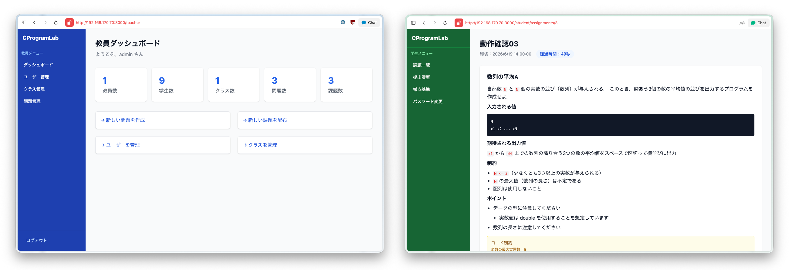

# C Programming Lab

C言語専用のプログラミング演習・自動採点プラットフォームです。
大学の授業（学生数十人規模）での使用を想定しており、学内サーバーで動作します。
学生はブラウザ上でC言語コードを記述・提出でき、即時に採点結果を確認できます。



## 機能概要

このシステムには **教員 / TA / 学生** の3種類のアカウントがあります。

### 教員
- ユーザー管理：教員・TAアカウントの作成・削除・パスワード管理
  - プライマリ管理者（初期 `admin` アカウント）のパスワードは本人のみ変更可能
  - 教員同士・TA同士は互いのパスワードを変更・削除不可（自分自身のパスワードは常に変更可能）
  - TAアカウントの作成・削除は教員のみ
- クラス・学生の管理（個別追加 / CSV一括インポート）
- 問題の作成・編集（テストケース・サンプルケース・コード制約の設定、Markdown問題文でのLaTeX数式表示に対応）
- 問題データの JSON インポート / エクスポート（1問1ファイル）
- 課題の配布（公開開始日時・締切日時に加え、解答開始期限を任意で設定可能）
- 課題の編集（タイトル・公開期間・解答開始期限の変更）
- 採点結果の一覧表示・CSV エクスポート（全提出履歴 / 学生ごとの最新スコアのみ・未提出者を含む）・提出コード閲覧・ZIP ダウンロード

### TA（教員より権限の低い補助アカウント）
- 全クラスの学生一覧・提出状況・採点結果の閲覧（CSV / ZIP エクスポート含む）
- 学生アカウントのパスワードリセット（対象は学生のみ）
- 問題・クラス・ユーザーの作成・編集・削除は不可（アカウントの作成・削除は教員のみ）

### 学生
- ブラウザ上での C 言語コード記述・提出（Monaco Editor、数式付き問題文の表示に対応）
- サンプル実行（提出前に動作確認、採点には影響しない）
- 即時採点結果・点数内訳の確認
- 解答時間の計測（「開始する」を押した時刻からサーバー側で記録）
- 課題に解答開始期限が設定されている場合、期限を過ぎて未開始のままだと解答できない
- 再提出（締切前かつ、全テストケース正解・減点なしの満点に達するまでは何度でも提出可能）
- 提出履歴の閲覧
- 採点基準ページの参照

## 技術スタック

| 区分 | 技術 |
|---|---|
| フロントエンド | Next.js 15（App Router）、TypeScript、Tailwind CSS、Monaco Editor、KaTeX（数式表示） |
| バックエンド | FastAPI（Python 3.12）、SQLAlchemy、Pydantic v2 |
| データベース | SQLite（`backend/data/cprogramlab.db`） |
| ジャッジエンジン | Docker + gcc 14（C言語のみ、サンドボックス実行） |
| 認証 | セッションベース（itsdangerous） |

## 採点基準

各課題は **100点満点** で採点されます。

```
合計点 = 正解点(50) + 全問正解ボーナス(20) + 時間点(30) − 減点
```

| 項目 | 点数 | 内容 |
|---|---|---|
| 正解点 | 最大50点 | テストケース正解数に比例（passed/total × 50） |
| 全問正解ボーナス | 20点 | 全テストケース合格時のみ加算 |
| 時間点 | 最大30点 | 開始から3分ごとに1点減点、90分以上で0点 |

**減点項目**（問題ごとに制約がある場合のみ適用）

| 条件 | 減点 |
|---|---|
| コンパイル警告あり | −20点 |
| 変数・配列・ポインタ数が制約超過 | 各 −20点 |
| ループ文・if文数が制約超過 | 各 −10点 |

全テストケース正解・減点なしの満点（100点）に達した場合、その課題は再提出できなくなります。

詳細は [RUBRIC.md](./RUBRIC.md) を参照してください。

## ディレクトリ構成

```
CProgramLab/
├── frontend/          # Next.js 15
├── backend/           # FastAPI
├── judge/             # ジャッジ用 Docker イメージ（gcc 14）
├── .devcontainer/     # Claude Code / 開発用コンテナ
├── docker-compose.yml
├── CLAUDE.md          # Claude Code 向けプロジェクト指示書
└── RUBRIC.md          # 採点基準の仕様書
```

## セットアップ・起動

### 前提条件

- Docker・Docker Compose がインストールされていること
- ジャッジ用イメージのビルドが完了していること（下記参照）

### ジャッジ用イメージのビルド（初回のみ）

```bash
docker build -t cprogramlab-judge:latest ./judge
```

### アプリの起動

```bash
# 環境変数ファイルの作成（SECRET_KEY は本番環境では必ず変更すること）
echo "SECRET_KEY=your-secret-key-here" > .env

# ビルドと起動
docker compose up -d backend frontend

# 動作確認
docker compose ps
```

起動後、ブラウザで `http://<サーバーIP>:3000` にアクセスしてください。

### 初期アカウント

| ユーザー名 | パスワード | 権限 |
|---|---|---|
| `admin` | `admin` | 教員（プライマリ管理者） |

> **注意**：初回ログイン後は必ずパスワードを変更してください。

TA・教員アカウントは、教員でログイン後「ユーザー管理」画面から追加作成できます（学生アカウントはクラス管理画面から作成）。

### アプリの停止

```bash
docker compose down
```

データベース（`backend_data` volume）はコンテナを停止しても保持されます。
データも含めて完全に削除する場合は `docker compose down -v` を使用してください。

---

## 開発者向け情報

### Claude Code 開発環境の起動

このリポジトリは Claude Code を使って開発されています。
開発用コンテナを使用する場合は以下の手順に従ってください。

```bash
# UID/GID を合わせる（初回のみ）
echo "DOCKER_UID=$(id -u)" >> .env
echo "DOCKER_GID=$(id -g)" >> .env

# 開発用コンテナのビルドと起動
DOCKER_UID=$(id -u) DOCKER_GID=$(id -g) docker compose build dev
docker compose up -d dev

# コンテナへ入る
docker compose exec dev bash
```

コンテナ内で Claude Code を起動します。

```bash
claude
```

### API エンドポイント一覧

バックエンドの API ドキュメント（Swagger UI）は起動後に以下の URL で確認できます。

```
http://localhost:8000/docs
```

主なエンドポイント：

| メソッド | パス | 概要 |
|---|---|---|
| POST | `/api/v1/auth/login` | ログイン |
| GET | `/api/v1/problems` | 問題一覧 |
| POST | `/api/v1/problems/import` | 問題インポート |
| GET | `/api/v1/assignments` | 課題一覧 |
| POST | `/api/v1/assignments/{id}/start` | 課題開始（開始時刻を記録） |
| POST | `/api/v1/submissions` | コード提出・採点（満点提出済みの場合は再提出を拒否） |
| POST | `/api/v1/submissions/run` | サンプル実行 |
| GET | `/api/v1/results/summary` | 採点結果一覧 |
| GET | `/api/v1/results/csv` | 採点結果CSV（全提出履歴） |
| GET | `/api/v1/results/csv/latest` | 採点結果CSV（学生ごとの最新スコアのみ、未提出者を含む） |
| PUT | `/api/v1/users/{id}/reset_password` | パスワードリセット（教員・TA用。TAは学生のみ対象） |

### 環境変数

| 変数名 | デフォルト値 | 説明 |
|---|---|---|
| `SECRET_KEY` | `dev-secret-key-change-in-production` | セッション署名キー（本番環境では変更必須） |
| `JUDGE_TMPDIR` | `/tmp/cprogramlab` | ジャッジ一時ファイルのディレクトリ |
| `BACKEND_URL` | `http://backend:8000` | フロントエンドからバックエンドへのURL |

### ジャッジの仕組み

1. 学生のコードを一時ファイルに書き出す（`JUDGE_TMPDIR` 以下）
2. `cplab-{uuid}` という名前の Docker コンテナを起動（`cprogramlab-judge:latest` イメージ）
3. コンテナ内でコンパイル・実行（タイムアウト：5秒/テストケース）
4. タイムアウト時は `docker kill` でコンテナを強制終了
5. ソースコードを静的解析してコード制約をチェック
6. 点数を計算して結果を DB に保存

セキュリティのため、ジャッジコンテナは非 root ユーザー（`sandbox`）で実行されます。

---

## サンプルデータ

`samples/` ディレクトリに、初期セットアップや動作確認に使えるサンプルデータを用意しています。

```
samples/
├── problems/   # サンプル問題（JSON形式、問題管理ページからインポート可能）
│   ├── problem_1_for文の使い方.json
│   └── problem_2_scanfとprintfの使い方.json
└── users/      # 学生一括登録用のCSVひな形
    └── students.csv
```

### サンプル問題（`samples/problems/`）

教員の問題管理ページ（「インポート」ボタン）から読み込めます。各ファイルは1問1ファイルの JSON 形式です。

| ファイル | 問題タイトル | テストケース | サンプルケース |
|---|---|---|---|
| `problem_1_for文の使い方.json` | for文の使い方 | 5件 | 2件 |
| `problem_2_scanfとprintfの使い方.json` | scanfとprintfの使い方 | 5件 | 2件 |

### 学生一括登録用CSV（`samples/users/`）

クラス管理ページの「CSVインポート」機能で使用できます。1行目はヘッダー行（`username,password`）で、2行目以降に1学生1行で記述します。

```csv
username,password
student01,pass01
student02,pass02
```

> **注意**：サンプル CSV のパスワードはそのまま使用しないでください。実際の運用時は安全なパスワードに変更してください。
